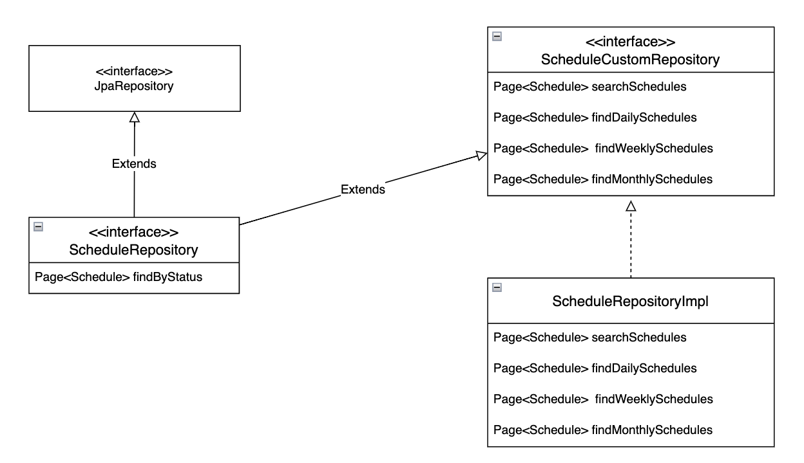

# hue-manager


이 프로젝트는 연차/당직 관리 어플리케이션으로, 패스트캠프 백엔드 부트캠프 당시 미완성 restful 프로젝트를 개선하고 정상작동하도록 완성한 프로젝트입니다.

# API 명세서
포스트맨으로 작성한 API 명세서입니다.

엔드포인트와 해당 컨트롤러의 설명, 그리고 요청 값 예시와 응답값 예시를 볼 수 있습니다.

링크에 접속하시면 전체적인 API 명세서를 확인하실 수 있습니다.
- [포스트맨 api 명세서](https://documenter.getpostman.com/view/25900230/2sA35G3hHw)


# 어플리케이션 아키텍처


# Erd


# 개발 환경

- `IntelliJ`
- `Gradle`
- `Java 17`
- `Git/Github`

# 기술 스택

- `Spring Boot MVC`
- `JWT`
- `Spring Security`
- `Spring Data JPA`
- `QueryDSL`
- `MySQL`
- `Postman`
- `Github Action`
- `Docker` `Docker Hub`
- `AWS` - `EC2` `RDS`

# 주요 기능

* 회원가입
* jwt 로그인
* 이메일 변경
* 비밀번호 변경
* 사원 정보 변경


* 나의 일정 저장
* 승인된 모든 일정 조회
* 나의 일정 조회
* 일 단위 승인된 모든 일정 조회
* 주 단위 승인된 모든 일정 조회
* 월 단위 승인된 모든 일정 조회
* 나의 일정 변경
* 나의 일정 삭제


* 일정 수락 or 거절
* 일정 검색

# 시퀀스 다이어그램


### employeeController
- 회원가입

    ```mermaid
    sequenceDiagram
        participant Client
        participant Controller
        participant Service
        participant EmployeeRepository
        Client->>Controller: POST /signup (SignUpRequest)
        Controller->>Service: signUp(request)
        Service->>EmployeeRepository: findByEmail(email)
        alt if email exists
            EmployeeRepository-->>Service: throw HueManagerException
            Service-->>Controller: return error response
            Controller-->>Client: 400 Bad Request (error details)
        else email does not exist
            Service->>EmployeeRepository: save(new Employee)
            EmployeeRepository-->>Service: savedEmployee
            Service-->>Controller: SignUpResponse
            Controller-->>Client: 200 OK (SignUpResponse)
        end
    
    ```

- jwt 로그인

    ```mermaid
    sequenceDiagram
        participant Client
        participant Controller
        participant LoginService
        participant UserDetailsRepository
        participant JwtTokenUtil
        participant AOP
        participant LoginLogService
        participant LoginLogRepository
        Client->>Controller: POST /login (LoginRequest)
        Controller->>LoginService: login(email, password)
        LoginService->>UserDetailsRepository: loadUserByUsername(email)
        UserDetailsRepository-->>LoginService: UserDetails
        LoginService->>LoginService: validate password
        alt if password is valid
            LoginService->>JwtTokenUtil: generateAccessToken(email)
            JwtTokenUtil-->>LoginService: JWT Token
            LoginService-->>AOP: return JWT Token
            AOP->>LoginLogService: logLogin(token)
            LoginLogService->>LoginLogRepository: saveLoginLog(employee, agent, clientIp, loginTime)
            LoginLogRepository-->>LoginLogService: Log recorded
            LoginLogService-->>AOP: Log recorded
            AOP-->>Controller: JWT Token
            Controller-->>Client: 200 OK (LoginResponse)
        else password is invalid
            LoginService-->>Controller: throw HueManagerException
            Controller-->>Client: 400 Bad Request (error details)
        end
    
    ```

- 이메일 변경

    ```mermaid
    sequenceDiagram
        participant Client
        participant Controller
        participant EmployeeService
        participant EmployeeRepository
        Client->>Controller: PUT /email (EmailUpdateRequest)
        Controller->>EmployeeService: updateEmail(employeeId, request)
        EmployeeService->>EmployeeRepository: findById(employeeId)
        EmployeeRepository-->>EmployeeService: Employee
        EmployeeService->>EmployeeService: check if new email equals current email
        alt if email is the same
            EmployeeService-->>Controller: throw HueManagerException(EMAIL_UNCHANGED)
            Controller-->>Client: 400 Bad Request (EMAIL_UNCHANGED error)
        else if email is different
            EmployeeService->>EmployeeRepository: findByEmail(newEmail)
            alt if email is duplicated
                EmployeeRepository-->>EmployeeService: throw HueManagerException(DUPLICATED_EMAIL)
                EmployeeService-->>Controller: throw HueManagerException(DUPLICATED_EMAIL)
                Controller-->>Client: 400 Bad Request (DUPLICATED_EMAIL error)
            else if email is unique
                EmployeeRepository-->>EmployeeService: Email is unique
                EmployeeService->>EmployeeRepository: setEmail(newEmail)
                EmployeeRepository-->>EmployeeService: Email updated
                EmployeeService-->>Controller: Success
                Controller-->>Client: 200 OK
            end
        end
    
    ```

- 비밀번호 변경

    ```mermaid
    sequenceDiagram
        participant Client
        participant Controller
        participant EmployeeService
        participant EmployeeRepository
        participant Encoder
        Client->>Controller: PUT /password (PasswordUpdateRequest)
        Controller->>EmployeeService: updatePassword(employeeId, request)
        EmployeeService->>EmployeeRepository: findById(employeeId)
        EmployeeRepository-->>EmployeeService: Employee
        EmployeeService->>Encoder: matches(currentPassword, employee.getPassword)
        alt if password does not match
            Encoder-->>EmployeeService: Passwords do not match
            EmployeeService-->>Controller: throw HueManagerException(INVALID_PASSWORD)
            Controller-->>Client: 400 Bad Request (INVALID_PASSWORD error)
        else if password matches
            EmployeeService->>EmployeeService: check if new password equals current password
            alt if passwords are the same
                EmployeeService-->>Controller: throw HueManagerException(PASSWORD_SAME_OLD)
                Controller-->>Client: 400 Bad Request (PASSWORD_SAME_OLD error)
            else if new password is different
                EmployeeService->>Encoder: encode(newPassword)
                Encoder-->>EmployeeService: Encoded password
                EmployeeService->>EmployeeRepository: setPassword(encodedPassword)
                EmployeeRepository-->>EmployeeService: Password updated
                EmployeeService-->>Controller: Success
                Controller-->>Client: 200 OK
            end
        end
    ```

- 사원 정보 변경

    ```mermaid
    sequenceDiagram
        participant Client
        participant Controller
        participant EmployeeService
        participant EmployeeRepository
        Client->>Controller: PUT /info (EmployeeInfoRequest)
        Controller->>EmployeeService: updateEmployeeInfo(employeeId, request)
        EmployeeService->>EmployeeRepository: findById(employeeId)
        EmployeeRepository-->>EmployeeService: Employee
        alt if name is provided
            EmployeeService->>EmployeeRepository: updateName(employeeId, name)
        end
        alt if phoneNumber is provided
            EmployeeService->>EmployeeRepository: updatePhoneNumber(employeeId, phoneNumber)
        end
        alt if position is provided
            EmployeeService->>EmployeeRepository: updatePosition(employeeId, position)
        end
        alt if department is provided
            EmployeeService->>EmployeeRepository: updateDepartment(employeeId, department)
        end
        EmployeeService-->>Controller: Success
        Controller-->>Client: 200 OK
    
    ```


### scheduleController

- 나의 일정 저장

    ```mermaid
    sequenceDiagram
        participant Client
        participant Controller
        participant ScheduleService
        participant EmployeeRepository
        participant ScheduleRepository
        Client->>Controller: POST /save (ScheduleRequest)
        Controller->>ScheduleService: saveSchedule(employeeId, request)
        ScheduleService->>EmployeeRepository: findEmployeeById(employeeId)
        EmployeeRepository-->>ScheduleService: Employee
        ScheduleService->>ScheduleService: validateScheduleRequest(request, employee)
        alt if ScheduleType is LEAVE and not enough vacation days
            ScheduleService-->>Controller: throw HueManagerException(NOT_ENOUGH_DAYS)
            Controller-->>Client: 400 Bad Request (NOT_ENOUGH_DAYS error)
        else if ScheduleType is NIGHT_SHIFT and dates do not match
            ScheduleService-->>Controller: throw HueManagerException(INVALID_NIGHT_SHIFT_REQUEST)
            Controller-->>Client: 400 Bad Request (INVALID_NIGHT_SHIFT_REQUEST error)
        else if request is valid
            ScheduleService->>ScheduleRepository: save(schedule)
            ScheduleRepository-->>ScheduleService: Schedule saved
            ScheduleService-->>Controller: Success
            Controller-->>Client: 200 OK
        end
    
    ```

- 승인된 모든 일정 조회

    ```mermaid
    sequenceDiagram
        participant Client
        participant Controller
        participant ScheduleService
        participant ScheduleRepository
        Client->>Controller: GET /all (Pageable)
        Controller->>ScheduleService: getAllApprovedSchedules(pageable)
        ScheduleService->>ScheduleRepository: findByStatus(ScheduleStatus.APPROVED, pageable)
        ScheduleRepository-->>ScheduleService: Page<Schedule>
        ScheduleService-->>Controller: Page<ScheduleDto>
        Controller-->>Client: 200 OK (Page<ScheduleDto>)
    
    ```

- 나의 일정(승인, 대기, 거절 모두) 조회

    ```mermaid
    sequenceDiagram
        participant Client
        participant Controller
        participant ScheduleService
        participant ScheduleRepository
        Client->>Controller: GET /my (Pageable)
        Controller->>ScheduleService: getEmployeeSchedules(employeeId, pageable)
        ScheduleService->>ScheduleRepository: findByEmployeeId(employeeId, pageable)
        ScheduleRepository-->>ScheduleService: Page<Schedule>
        ScheduleService-->>Controller: Page<ScheduleDto>
        Controller-->>Client: 200 OK (Page<ScheduleDto>)
    
    ```

- 일 단위 승인된 모든 일정 조회

    ```mermaid
    sequenceDiagram
        participant Client
        participant Controller
        participant ScheduleService
        participant ScheduleRepository
        Client->>Controller: GET /day (date, Pageable)
        Controller->>ScheduleService: getDaySchedules(date, pageable)
        ScheduleService->>ScheduleRepository: findByStartDateBetweenAndStatus(date, date, ScheduleStatus.APPROVED, pageable)
        ScheduleRepository-->>ScheduleService: Page<Schedule>
        ScheduleService-->>Controller: Page<ScheduleDto>
        Controller-->>Client: 200 OK (Page<ScheduleDto>)
    
    ```

- 주 단위 승인된 모든 일정 조회

    ```mermaid
    sequenceDiagram
        participant Client
        participant Controller
        participant ScheduleService
        participant ScheduleRepository
        Client->>Controller: GET /week (date, Pageable)
        Controller->>ScheduleService: getWeekSchedules(date, pageable)
        ScheduleService->>ScheduleRepository: findByStartDateBetweenAndStatus(startDate, endDate, ScheduleStatus.APPROVED, pageable)
        ScheduleRepository-->>ScheduleService: Page<Schedule>
        ScheduleService-->>Controller: Page<ScheduleDto>
        Controller-->>Client: 200 OK (Page<ScheduleDto>)
    
    ```

- 월 단위 승인된 모든 일정 조회

    ```mermaid
    sequenceDiagram
        participant Client
        participant Controller
        participant ScheduleService
        participant ScheduleRepository
        Client->>Controller: GET /month (date, Pageable)
        Controller->>ScheduleService: getMonthSchedules(date, pageable)
        ScheduleService->>ScheduleRepository: findByStartDateBetweenAndStatus(startDate, endDate, ScheduleStatus.APPROVED, pageable)
        ScheduleRepository-->>ScheduleService: Page<Schedule>
        ScheduleService-->>Controller: Page<ScheduleDto>
        Controller-->>Client: 200 OK (Page<ScheduleDto>)
    
    ```

- 나의 일정 변경

    ```mermaid
    sequenceDiagram
        participant Client
        participant Controller
        participant ScheduleService
        participant EmployeeRepository
        participant ScheduleRepository
        Client->>Controller: PUT /{scheduleId}/update (ScheduleRequest)
        Controller->>ScheduleService: updateSchedule(employeeId, scheduleId, request)
        ScheduleService->>EmployeeRepository: findEmployeeById(employeeId)
        EmployeeRepository-->>ScheduleService: Employee
        ScheduleService->>ScheduleRepository: findScheduleById(scheduleId)
        ScheduleRepository-->>ScheduleService: Schedule
        ScheduleService->>ScheduleService: validateScheduleAuthorized(schedule, employee)
        alt if schedule is not pending or employee is not authorized
            ScheduleService-->>Controller: throw HueManagerException(SCHEDULE_NOT_PENDING or UNAUTHORIZED_SCHEDULE)
            Controller-->>Client: 400 Bad Request (Error)
        else if schedule is pending and employee is authorized
            ScheduleService->>ScheduleService: validateScheduleRequest(request, employee)
            alt if request is invalid
                ScheduleService-->>Controller: throw HueManagerException(NOT_ENOUGH_DAYS or INVALID_NIGHT_SHIFT_REQUEST)
                Controller-->>Client: 400 Bad Request (Error)
            else if request is valid
                ScheduleService->>ScheduleRepository: update(schedule)
                ScheduleRepository-->>ScheduleService: Schedule updated
                ScheduleService-->>Controller: Success
                Controller-->>Client: 200 OK
            end
        end
    
    ```

- 나의 일정 삭제

    ```mermaid
    sequenceDiagram
        participant Client
        participant Controller
        participant ScheduleService
        participant EmployeeRepository
        participant ScheduleRepository
        Client->>Controller: DELETE /{scheduleId}
        Controller->>ScheduleService: deleteSchedule(employeeId, scheduleId)
        ScheduleService->>EmployeeRepository: findEmployeeById(employeeId)
        EmployeeRepository-->>ScheduleService: Employee
        ScheduleService->>ScheduleRepository: findScheduleById(scheduleId)
        ScheduleRepository-->>ScheduleService: Schedule
        ScheduleService->>ScheduleService: validateScheduleAuthorized(schedule, employee)
        alt if schedule is pending and employee is authorized
            ScheduleService->>ScheduleRepository: delete(schedule)
            ScheduleRepository-->>ScheduleService: Schedule deleted
            ScheduleService-->>Controller: Success
            Controller-->>Client: 200 OK
        else if schedule is not pending or employee is not authorized
            ScheduleService-->>Controller: throw HueManagerException(SCHEDULE_NOT_PENDING or UNAUTHORIZED_SCHEDULE)
            Controller-->>Client: 400 Bad Request (Error)
        end
    
    ```


### adminController

- 일정 수락 or 거절

    ```mermaid
    sequenceDiagram
        participant Client
        participant Controller
        participant AdminAuthAspect
        participant AdminService
        participant ScheduleRepository
        Client->>Controller: POST /schedule/{scheduleId}/status (StatusUpdateRequest)
        Controller->>AdminAuthAspect: checkAdminRole()
        AdminAuthAspect->>AdminAuthAspect: getAuthentication()
        alt if user is not an employee or not admin
            AdminAuthAspect-->>Controller: throw HueManagerException(NOT_AN_EMPLOYEE or NOT_AN_ADMIN)
            Controller-->>Client: 403 Forbidden (Error)
        else if user is admin
            AdminAuthAspect-->>AdminService: proceed()
            AdminService->>ScheduleRepository: findScheduleById(scheduleId)
            ScheduleRepository-->>AdminService: Schedule
            AdminService->>AdminService: check if schedule status is PENDING
            alt if schedule is not PENDING
                AdminService-->>Controller: throw HueManagerException(SCHEDULE_NOT_PENDING)
                Controller-->>Client: 400 Bad Request (Error)
            else if schedule is PENDING
                AdminService->>ScheduleRepository: setStatus(newStatus)
                alt if newStatus is REJECTED and type is LEAVE
                    AdminService->>AdminService: updateEmployeeVacationCount(employee, days)
                end
                ScheduleRepository-->>AdminService: Status updated
                AdminService-->>Controller: Success
                Controller-->>Client: 200 OK
            end
        end
    
    ```

- 일정 검색

    ```mermaid
    sequenceDiagram
        participant Client
        participant Controller
        participant AdminAuthAspect
        participant AdminService
        participant ScheduleRepository
        Client->>Controller: POST /search (ScheduleSearchRequest, Pageable)
        Controller->>AdminAuthAspect: checkAdminRole()
        AdminAuthAspect->>AdminAuthAspect: getAuthentication()
        alt if user is not an employee or not admin
            AdminAuthAspect-->>Controller: throw HueManagerException(NOT_AN_EMPLOYEE or NOT_AN_ADMIN)
            Controller-->>Client: 403 Forbidden (Error)
        else if user is admin
            AdminAuthAspect-->>AdminService: proceed()
            AdminService->>ScheduleRepository: searchSchedules
            ScheduleRepository-->>AdminService: Page<Schedule>
            AdminService-->>Controller: Page<ScheduleDto>
            Controller-->>Client: 200 OK (Page<ScheduleDto>)
        end
    
    ```
# 개발 당시 고민사항
## 1. 동적쿼리와 복잡한 쿼리를 어떻게 처리할 것인가
팀 프로젝트 협업 당시 복잡한 쿼리를 spring data jpa만으로 해결해보려다가 목표 기한이 끝난 것이었습니다.

jpa만으로는 한계가 있었습니다. 

이를 해결하고자 QueryDSL을 도입했습니다.

간단한 쿼리를 간편하게 처리하는 spring data jpa와

복잡한 쿼리와 동적쿼리를 다룰 수 있게 해줄 JPQL 쿼리 빌더인 QueryDSL를 함께 사용하고자 아래와 같은 방식으로 구현했습니다.



## 2. 권한에 따른 기능 제한은 어떻게 할 것인가
이 프로젝트에서 관리자는 모든 기능을 사용 가능하지만 일반 사원은 검색 기능과 일정 수락 or 거절 기능은 접근하지 못하도록 해야했습니다.

관리자만 접근할 수 있는 기능이 많을 수록 비슷한 처리를 반복해야하는 문제가 있었습니다. 이를 해결하기 위해 AOP를 사용했습니다.

* RequireAdminRole 어노테이션
  ```java
  @Retention(RetentionPolicy.RUNTIME)
  @Target(ElementType.METHOD)
  public @interface RequireAdminRole {
  }
  ```

* 어노테이션이 붙으면 작동할 내용
  ```java
  @Aspect
  @Component
  public class AdminAuthAspect {
  
  @Around("@annotation(com.rko.huemanager.aop.RequireAdminRole)")
  public Object checkAdminRole(ProceedingJoinPoint joinPoint) throws Throwable {
      Authentication authentication = SecurityContextHolder.getContext().getAuthentication();
  
      if (!(authentication.getPrincipal() instanceof Employee)) {
          throw new HueManagerException(ErrorCode.NOT_AN_EMPLOYEE);
      }
      Employee employee = (Employee) authentication.getPrincipal();
  
      if (!employee.getRole().equals(Role.ROLE_ADMIN)){
          throw new HueManagerException(ErrorCode.NOT_AN_ADMIN);
      }
      return joinPoint.proceed();
  }
  }
  ```

* 어노테이션을 사용한 코드
  ```java
  @Aspect
  @Component
  public class AdminAuthAspect {
  @PostMapping("/search")
    @RequireAdminRole
    public Response<Page<ScheduleDto>> searchSchedules(@RequestBody ScheduleSearchRequest request,
                                                       @PageableDefault(size = 20, sort = "startDate", direction = Sort.Direction.ASC) Pageable pageable){
        return Response.success(adminService.searchSchedules(request, pageable));
    }

    @PostMapping("/schedule/{scheduleId}/status")
    @RequireAdminRole
    public Response<Void> updateScheduleStatus(@PathVariable Long scheduleId, @RequestBody StatusUpdateRequest request){
        adminService.updateScheduleStatus(scheduleId, request.status());
        return Response.success();
    }
  }
  ```
이렇게 컨트롤러에 **RequireAdminRole** 어노테이션만 붙여주어 훨씬 가독성있고 명확한 코드가 되었습니다.

이 후 관리자 기능이 더 늘아난다고 해도 어노테이션만 붙여주면 간단하게 권한에 따른 기능 제한을 구현할 수 있습니다.

## 3. 로그인 성공시 로그를 남기는 기능을 어떻게 구현할 것인가
로그인 성공시 클라이언트의 ip와 클라이언트의 브라우저, 운영 체제 등의 정보를 알 수 있는 agent, 그리고 로그인 성공 시간을 로그로 남겨야했습니다.

컨트롤러에서 HttpServletRequest를 사용하면 클라이언트의 ip, agent를 알 수 있다는 것을 깨닫고 컨트롤러를 작성했습니다.

하지만 이렇게 하면 컨트롤러 코드의 가독성이 떨어지는 문제가 있었습니다.

그래서 여기서도 AOP를 적용했습니다.

* Loggable 어노테이션
  ```java
  @Retention(RetentionPolicy.RUNTIME)
  @Target(ElementType.METHOD)
  public @interface Loggable {
  }
  ```

* 어노테이션이 붙으면 작동할 내용
  ```java
  @AfterReturning(value = "@annotation(Loggable)", returning = "token")
      public void logLogin(String token){
          if (token != null && !JwtTokenUtils.isTokenExpired(token, secretKey)){
              String email = JwtTokenUtils.getUsername(token, secretKey);
              HttpServletRequest request =
                      ((ServletRequestAttributes) RequestContextHolder.currentRequestAttributes()).getRequest();
              String agent = request.getHeader("User-Agent");
              String clientIp = request.getRemoteAddr();
  
              Employee employee = employeeRepository.findByEmail(email).orElseThrow(() -> new HueManagerException(ErrorCode.EMPLOYEE_NOT_FOUND, String.format("email is %s", email)));
              if (employee != null){
                  loginLogService.saveLoginLog(employee, agent, clientIp, LocalDateTime.now());
              }
          }
  
      }
  ```

* 어노테이션을 사용한 코드
  ```java
  @Loggable
  public String login(String email, String password){
    UserDetails savedEmployee = loadUserByUsername(email);
    if (!encoder.matches(password, savedEmployee.getPassword())) {
    throw new HueManagerException(ErrorCode.INVALID_PASSWORD);
    }
    return JwtTokenUtils.generateAccessToken(email, secretKey, expiredTimeMs);
  }
  ```

이렇게 서비스 로직에 Loggable 어노테이션을 붙여서 로그인 성공시 클라이언트 ip, agent, 로그인 시간을 로그로 남길 수 있습니다.

컨트롤러 차이를 보자면 아래와 같습니다.

* Before
```java
  @PostMapping("/login")
public HttpEntity<Map> login(@RequestBody @Valid UserLoginRequest request,
        HttpServletRequest httpServletRequest) {

        Map<String, String> map = new HashMap<>();

        if (httpServletRequest.getHeader("token") != null) {
        map.put("message", "이미 로그인 되어있습니다.");
        return ResponseEntity.status(400).body(map);
        }

        String token = loginService.login(request.getEmail(), request.getPassword());
        User user = userService.getUserByEmail(request.getEmail());
        map.put("userId", loginService.getUserIdByEmail(request.getEmail()));
        map.put("token", token);
        if (user.getRole().equals(Role.DEFAULT)) {
        map.put("message", WAITING);
        } else {
        map.put("message", LOGIN_SUCCESS);
        }
        String agent = httpServletRequest.getHeader("User-Agent");
        String clientIp = httpServletRequest.getRemoteAddr();
        LocalDateTime loginTime = LocalDateTime.now(); // 로그인 시간 기록
        loginLogService.createLoginLog(user, agent, clientIp, loginTime);
  return ResponseEntity.ok(map);
}
  ```
이렇게 지저분했던 로그인 컨트롤러를 

* After
```java
@PostMapping("/login")
public Response<LoginResponse> login(@Valid @RequestBody LoginRequest request) {
    String token = employeeService.login(request.email(), request.password());
    return Response.success(new LoginResponse(token));
}
  ```
이렇게 가독성있고 깔끔하게 수정했습니다.

## 4. CI/CD 어떻게 구현할 것인가
이 과정에서 가장 중점적으로 고민한 것은 비용 문제입니다.

사용할 수 있는 운영비용이 넉넉하지 않아서 처음엔 최대한 비용을 줄이는 방식을 택했습니다.

docker와 github action으로 CI/CD를 구현하고자 하는데

ecr과 docker hub 중 비용이 들지 않은 docker hub를 택했고

docekr-compose를 이용해서 어플리케이션 컨테이너와 mysql 컨테이너를 띄우는 방식으로 aws rds를 사용하지않고 오직 ec2만 사용하는 방법으로 비용을 줄이려고 했습니다.

그러나 이 방법은 제가 코드를 수정하거나 기능을 추가할 때마다 mysql 컨테이너가 재생성 되는 과정에서 기존에 있던 데이터가 날아가는 문제가 있었습니다.

결국 이 문제를 해결하기위해 ec2에 어플리케이션 컨테이너만 띄우고 aws rds를 사용하여 어플리케이션과 rds를 연결하는 방식을 최종적으로 결정했습니다.