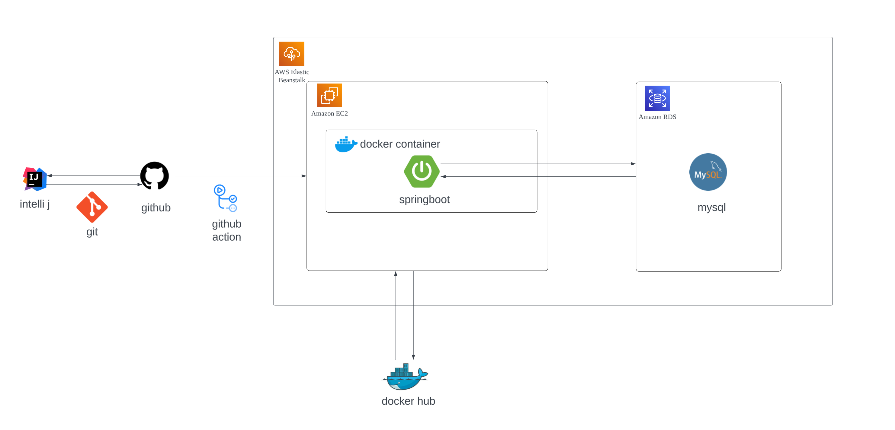
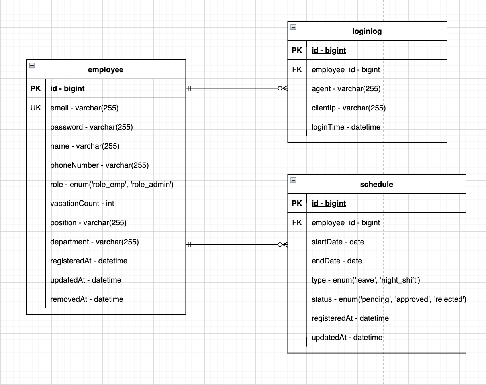

# hue-manager

---

이 프로젝트는 연차/당직 관리 어플리케이션으로, 패스트캠프 백엔드 부트캠프 당시 미완성 restful 프로젝트를 정상작동하도록 완성시키는 프로젝트입니다.

# API 명세서

---

포스트맨으로 작성한 명세서입니다.

- [포스트맨 api 명세서](https://documenter.getpostman.com/view/25900230/2sA35G3hHw)

swagger 또한 확인 가능합니다.

- [hue-manager restful api](http://hue-manager.ap-northeast-2.elasticbeanstalk.com/swagger-ui.html)


# 개발 환경

- `intellij`
- `Gradle`
- `Java 17`
- `git/github`

# 기술 스택

- `spring boot mvc`
- `spring security`
- `spring data jpa`
- `jwt`
- `querydsl`
- `mysql`
- `github action`
- `docker` `docker hub`
- `AWS` - `EC2` `RDS`

# 시스템 아키텍처

---



# Erd

---



# 시퀀스 다이어그램

---

### employeeController

- 회원가입

    ```mermaid
    sequenceDiagram
        participant Client
        participant Controller
        participant Service
        participant EmployeeRepository
        Client->>Controller: POST /signup (SignUpRequest)
        Controller->>Service: signUp(request)
        Service->>EmployeeRepository: findByEmail(email)
        alt if email exists
            EmployeeRepository-->>Service: throw HueManagerException
            Service-->>Controller: return error response
            Controller-->>Client: 400 Bad Request (error details)
        else email does not exist
            Service->>EmployeeRepository: save(new Employee)
            EmployeeRepository-->>Service: savedEmployee
            Service-->>Controller: SignUpResponse
            Controller-->>Client: 200 OK (SignUpResponse)
        end
    
    ```

- jwt 로그인

    ```mermaid
    sequenceDiagram
        participant Client
        participant Controller
        participant LoginService
        participant UserDetailsRepository
        participant JwtTokenUtil
        participant AOP
        participant LoginLogService
        participant LoginLogRepository
        Client->>Controller: POST /login (LoginRequest)
        Controller->>LoginService: login(email, password)
        LoginService->>UserDetailsRepository: loadUserByUsername(email)
        UserDetailsRepository-->>LoginService: UserDetails
        LoginService->>LoginService: validate password
        alt if password is valid
            LoginService->>JwtTokenUtil: generateAccessToken(email)
            JwtTokenUtil-->>LoginService: JWT Token
            LoginService-->>AOP: return JWT Token
            AOP->>LoginLogService: logLogin(token)
            LoginLogService->>LoginLogRepository: saveLoginLog(employee, agent, clientIp, loginTime)
            LoginLogRepository-->>LoginLogService: Log recorded
            LoginLogService-->>AOP: Log recorded
            AOP-->>Controller: JWT Token
            Controller-->>Client: 200 OK (LoginResponse)
        else password is invalid
            LoginService-->>Controller: throw HueManagerException
            Controller-->>Client: 400 Bad Request (error details)
        end
    
    ```

- 이메일 변경

    ```mermaid
    sequenceDiagram
        participant Client
        participant Controller
        participant EmployeeService
        participant EmployeeRepository
        Client->>Controller: PUT /email (EmailUpdateRequest)
        Controller->>EmployeeService: updateEmail(employeeId, request)
        EmployeeService->>EmployeeRepository: findById(employeeId)
        EmployeeRepository-->>EmployeeService: Employee
        EmployeeService->>EmployeeService: check if new email equals current email
        alt if email is the same
            EmployeeService-->>Controller: throw HueManagerException(EMAIL_UNCHANGED)
            Controller-->>Client: 400 Bad Request (EMAIL_UNCHANGED error)
        else if email is different
            EmployeeService->>EmployeeRepository: findByEmail(newEmail)
            alt if email is duplicated
                EmployeeRepository-->>EmployeeService: throw HueManagerException(DUPLICATED_EMAIL)
                EmployeeService-->>Controller: throw HueManagerException(DUPLICATED_EMAIL)
                Controller-->>Client: 400 Bad Request (DUPLICATED_EMAIL error)
            else if email is unique
                EmployeeRepository-->>EmployeeService: Email is unique
                EmployeeService->>EmployeeRepository: setEmail(newEmail)
                EmployeeRepository-->>EmployeeService: Email updated
                EmployeeService-->>Controller: Success
                Controller-->>Client: 200 OK
            end
        end
    
    ```

- 비밀번호 변경

    ```mermaid
    sequenceDiagram
        participant Client
        participant Controller
        participant EmployeeService
        participant EmployeeRepository
        participant Encoder
        Client->>Controller: PUT /password (PasswordUpdateRequest)
        Controller->>EmployeeService: updatePassword(employeeId, request)
        EmployeeService->>EmployeeRepository: findById(employeeId)
        EmployeeRepository-->>EmployeeService: Employee
        EmployeeService->>Encoder: matches(currentPassword, employee.getPassword)
        alt if password does not match
            Encoder-->>EmployeeService: Passwords do not match
            EmployeeService-->>Controller: throw HueManagerException(INVALID_PASSWORD)
            Controller-->>Client: 400 Bad Request (INVALID_PASSWORD error)
        else if password matches
            EmployeeService->>EmployeeService: check if new password equals current password
            alt if passwords are the same
                EmployeeService-->>Controller: throw HueManagerException(PASSWORD_SAME_OLD)
                Controller-->>Client: 400 Bad Request (PASSWORD_SAME_OLD error)
            else if new password is different
                EmployeeService->>Encoder: encode(newPassword)
                Encoder-->>EmployeeService: Encoded password
                EmployeeService->>EmployeeRepository: setPassword(encodedPassword)
                EmployeeRepository-->>EmployeeService: Password updated
                EmployeeService-->>Controller: Success
                Controller-->>Client: 200 OK
            end
        end
    ```

- 사원 정보 변경

    ```mermaid
    sequenceDiagram
        participant Client
        participant Controller
        participant EmployeeService
        participant EmployeeRepository
        Client->>Controller: PUT /info (EmployeeInfoRequest)
        Controller->>EmployeeService: updateEmployeeInfo(employeeId, request)
        EmployeeService->>EmployeeRepository: findById(employeeId)
        EmployeeRepository-->>EmployeeService: Employee
        alt if name is provided
            EmployeeService->>EmployeeRepository: updateName(employeeId, name)
        end
        alt if phoneNumber is provided
            EmployeeService->>EmployeeRepository: updatePhoneNumber(employeeId, phoneNumber)
        end
        alt if position is provided
            EmployeeService->>EmployeeRepository: updatePosition(employeeId, position)
        end
        alt if department is provided
            EmployeeService->>EmployeeRepository: updateDepartment(employeeId, department)
        end
        EmployeeService-->>Controller: Success
        Controller-->>Client: 200 OK
    
    ```


### scheduleController

- 나의 일정 저장

    ```mermaid
    sequenceDiagram
        participant Client
        participant Controller
        participant ScheduleService
        participant EmployeeRepository
        participant ScheduleRepository
        Client->>Controller: POST /save (ScheduleRequest)
        Controller->>ScheduleService: saveSchedule(employeeId, request)
        ScheduleService->>EmployeeRepository: findEmployeeById(employeeId)
        EmployeeRepository-->>ScheduleService: Employee
        ScheduleService->>ScheduleService: validateScheduleRequest(request, employee)
        alt if ScheduleType is LEAVE and not enough vacation days
            ScheduleService-->>Controller: throw HueManagerException(NOT_ENOUGH_DAYS)
            Controller-->>Client: 400 Bad Request (NOT_ENOUGH_DAYS error)
        else if ScheduleType is NIGHT_SHIFT and dates do not match
            ScheduleService-->>Controller: throw HueManagerException(INVALID_NIGHT_SHIFT_REQUEST)
            Controller-->>Client: 400 Bad Request (INVALID_NIGHT_SHIFT_REQUEST error)
        else if request is valid
            ScheduleService->>ScheduleRepository: save(schedule)
            ScheduleRepository-->>ScheduleService: Schedule saved
            ScheduleService-->>Controller: Success
            Controller-->>Client: 200 OK
        end
    
    ```

- 승인된 모든 일정 조회

    ```mermaid
    sequenceDiagram
        participant Client
        participant Controller
        participant ScheduleService
        participant ScheduleRepository
        Client->>Controller: GET /all (Pageable)
        Controller->>ScheduleService: getAllApprovedSchedules(pageable)
        ScheduleService->>ScheduleRepository: findByStatus(ScheduleStatus.APPROVED, pageable)
        ScheduleRepository-->>ScheduleService: Page<Schedule>
        ScheduleService-->>Controller: Page<ScheduleDto>
        Controller-->>Client: 200 OK (Page<ScheduleDto>)
    
    ```

- 나의 일정(승인, 대기, 거절 모두) 조회

    ```mermaid
    sequenceDiagram
        participant Client
        participant Controller
        participant ScheduleService
        participant ScheduleRepository
        Client->>Controller: GET /my (Pageable)
        Controller->>ScheduleService: getEmployeeSchedules(employeeId, pageable)
        ScheduleService->>ScheduleRepository: findByEmployeeId(employeeId, pageable)
        ScheduleRepository-->>ScheduleService: Page<Schedule>
        ScheduleService-->>Controller: Page<ScheduleDto>
        Controller-->>Client: 200 OK (Page<ScheduleDto>)
    
    ```

- 일 단위 승인된 모든 일정 조회

    ```mermaid
    sequenceDiagram
        participant Client
        participant Controller
        participant ScheduleService
        participant ScheduleRepository
        Client->>Controller: GET /day (date, Pageable)
        Controller->>ScheduleService: getDaySchedules(date, pageable)
        ScheduleService->>ScheduleRepository: findByStartDateBetweenAndStatus(date, date, ScheduleStatus.APPROVED, pageable)
        ScheduleRepository-->>ScheduleService: Page<Schedule>
        ScheduleService-->>Controller: Page<ScheduleDto>
        Controller-->>Client: 200 OK (Page<ScheduleDto>)
    
    ```

- 주 단위 승인된 모든 일정 조회

    ```mermaid
    sequenceDiagram
        participant Client
        participant Controller
        participant ScheduleService
        participant ScheduleRepository
        Client->>Controller: GET /week (date, Pageable)
        Controller->>ScheduleService: getWeekSchedules(date, pageable)
        ScheduleService->>ScheduleRepository: findByStartDateBetweenAndStatus(startDate, endDate, ScheduleStatus.APPROVED, pageable)
        ScheduleRepository-->>ScheduleService: Page<Schedule>
        ScheduleService-->>Controller: Page<ScheduleDto>
        Controller-->>Client: 200 OK (Page<ScheduleDto>)
    
    ```

- 월 단위 승인된 모든 일정 조회

    ```mermaid
    sequenceDiagram
        participant Client
        participant Controller
        participant ScheduleService
        participant ScheduleRepository
        Client->>Controller: GET /month (date, Pageable)
        Controller->>ScheduleService: getMonthSchedules(date, pageable)
        ScheduleService->>ScheduleRepository: findByStartDateBetweenAndStatus(startDate, endDate, ScheduleStatus.APPROVED, pageable)
        ScheduleRepository-->>ScheduleService: Page<Schedule>
        ScheduleService-->>Controller: Page<ScheduleDto>
        Controller-->>Client: 200 OK (Page<ScheduleDto>)
    
    ```

- 나의 일정 변경

    ```mermaid
    sequenceDiagram
        participant Client
        participant Controller
        participant ScheduleService
        participant EmployeeRepository
        participant ScheduleRepository
        Client->>Controller: PUT /{scheduleId}/update (ScheduleRequest)
        Controller->>ScheduleService: updateSchedule(employeeId, scheduleId, request)
        ScheduleService->>EmployeeRepository: findEmployeeById(employeeId)
        EmployeeRepository-->>ScheduleService: Employee
        ScheduleService->>ScheduleRepository: findScheduleById(scheduleId)
        ScheduleRepository-->>ScheduleService: Schedule
        ScheduleService->>ScheduleService: validateScheduleAuthorized(schedule, employee)
        alt if schedule is not pending or employee is not authorized
            ScheduleService-->>Controller: throw HueManagerException(SCHEDULE_NOT_PENDING or UNAUTHORIZED_SCHEDULE)
            Controller-->>Client: 400 Bad Request (Error)
        else if schedule is pending and employee is authorized
            ScheduleService->>ScheduleService: validateScheduleRequest(request, employee)
            alt if request is invalid
                ScheduleService-->>Controller: throw HueManagerException(NOT_ENOUGH_DAYS or INVALID_NIGHT_SHIFT_REQUEST)
                Controller-->>Client: 400 Bad Request (Error)
            else if request is valid
                ScheduleService->>ScheduleRepository: update(schedule)
                ScheduleRepository-->>ScheduleService: Schedule updated
                ScheduleService-->>Controller: Success
                Controller-->>Client: 200 OK
            end
        end
    
    ```

- 나의 일정 삭제

    ```mermaid
    sequenceDiagram
        participant Client
        participant Controller
        participant ScheduleService
        participant EmployeeRepository
        participant ScheduleRepository
        Client->>Controller: DELETE /{scheduleId}
        Controller->>ScheduleService: deleteSchedule(employeeId, scheduleId)
        ScheduleService->>EmployeeRepository: findEmployeeById(employeeId)
        EmployeeRepository-->>ScheduleService: Employee
        ScheduleService->>ScheduleRepository: findScheduleById(scheduleId)
        ScheduleRepository-->>ScheduleService: Schedule
        ScheduleService->>ScheduleService: validateScheduleAuthorized(schedule, employee)
        alt if schedule is pending and employee is authorized
            ScheduleService->>ScheduleRepository: delete(schedule)
            ScheduleRepository-->>ScheduleService: Schedule deleted
            ScheduleService-->>Controller: Success
            Controller-->>Client: 200 OK
        else if schedule is not pending or employee is not authorized
            ScheduleService-->>Controller: throw HueManagerException(SCHEDULE_NOT_PENDING or UNAUTHORIZED_SCHEDULE)
            Controller-->>Client: 400 Bad Request (Error)
        end
    
    ```


### adminController

- 일정 수락 or 거절

    ```mermaid
    sequenceDiagram
        participant Client
        participant Controller
        participant AdminAuthAspect
        participant AdminService
        participant ScheduleRepository
        Client->>Controller: POST /schedule/{scheduleId}/status (StatusUpdateRequest)
        Controller->>AdminAuthAspect: checkAdminRole()
        AdminAuthAspect->>AdminAuthAspect: getAuthentication()
        alt if user is not an employee or not admin
            AdminAuthAspect-->>Controller: throw HueManagerException(NOT_AN_EMPLOYEE or NOT_AN_ADMIN)
            Controller-->>Client: 403 Forbidden (Error)
        else if user is admin
            AdminAuthAspect-->>AdminService: proceed()
            AdminService->>ScheduleRepository: findScheduleById(scheduleId)
            ScheduleRepository-->>AdminService: Schedule
            AdminService->>AdminService: check if schedule status is PENDING
            alt if schedule is not PENDING
                AdminService-->>Controller: throw HueManagerException(SCHEDULE_NOT_PENDING)
                Controller-->>Client: 400 Bad Request (Error)
            else if schedule is PENDING
                AdminService->>ScheduleRepository: setStatus(newStatus)
                alt if newStatus is REJECTED and type is LEAVE
                    AdminService->>AdminService: updateEmployeeVacationCount(employee, days)
                end
                ScheduleRepository-->>AdminService: Status updated
                AdminService-->>Controller: Success
                Controller-->>Client: 200 OK
            end
        end
    
    ```

- 일정 검색

    ```mermaid
    sequenceDiagram
        participant Client
        participant Controller
        participant AdminAuthAspect
        participant AdminService
        participant ScheduleRepository
        Client->>Controller: POST /search (ScheduleSearchRequest, Pageable)
        Controller->>AdminAuthAspect: checkAdminRole()
        AdminAuthAspect->>AdminAuthAspect: getAuthentication()
        alt if user is not an employee or not admin
            AdminAuthAspect-->>Controller: throw HueManagerException(NOT_AN_EMPLOYEE or NOT_AN_ADMIN)
            Controller-->>Client: 403 Forbidden (Error)
        else if user is admin
            AdminAuthAspect-->>AdminService: proceed()
            AdminService->>ScheduleRepository: searchSchedules
            ScheduleRepository-->>AdminService: Page<Schedule>
            AdminService-->>Controller: Page<ScheduleDto>
            Controller-->>Client: 200 OK (Page<ScheduleDto>)
        end
    
    ```
    